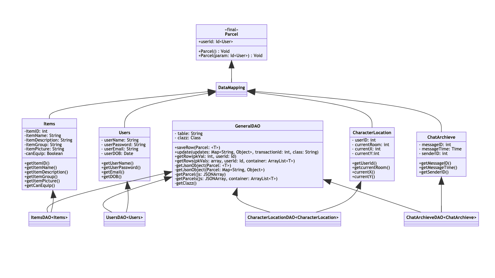
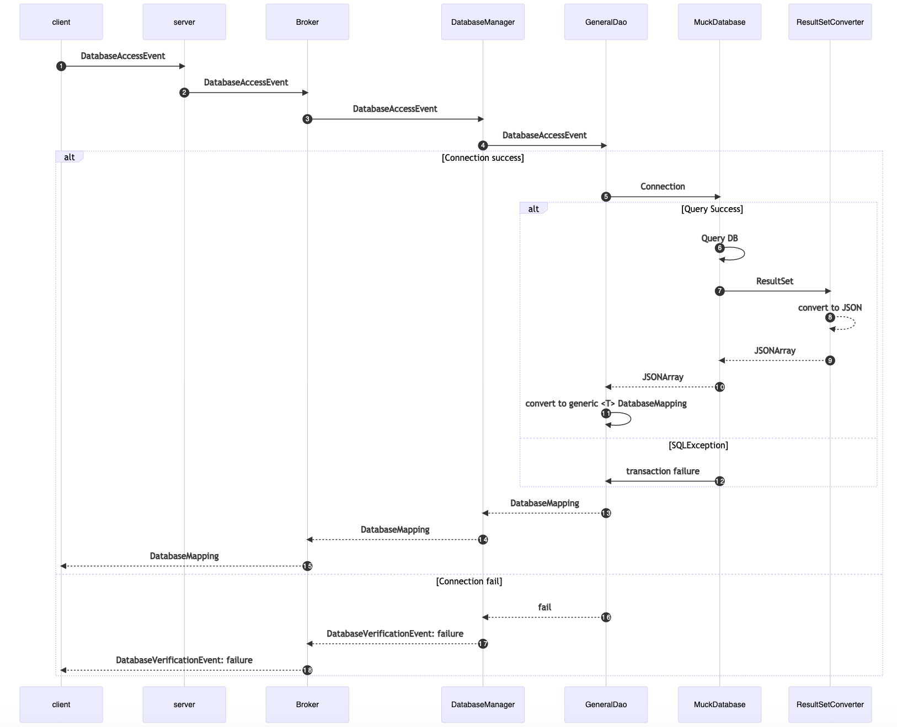
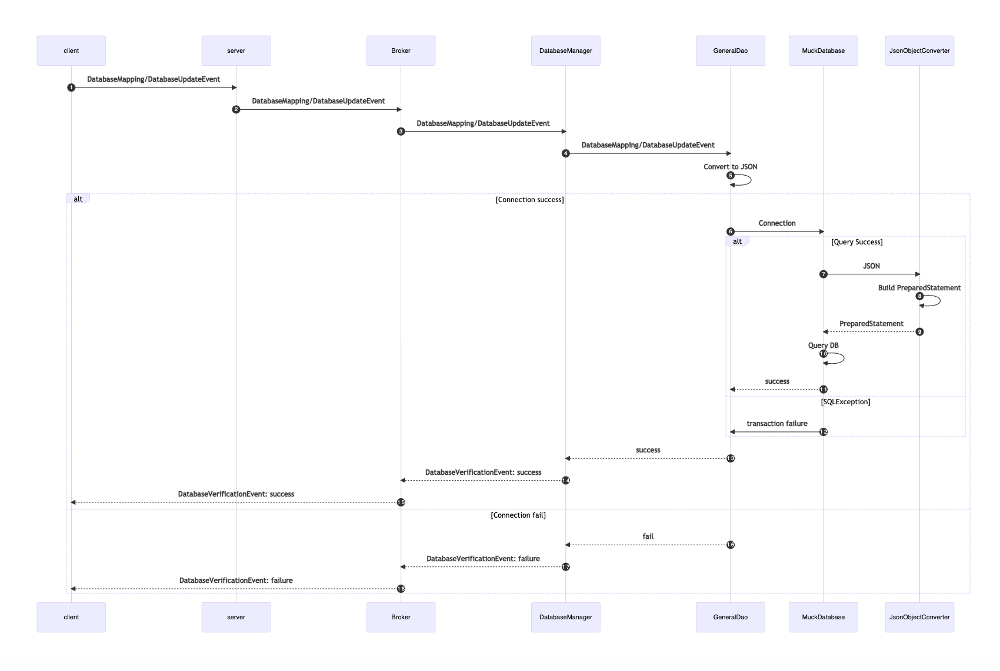

## Project Overview:
This project was a class wide Software project working in small teams all contributing to the development of an application. Our team choose to work on Server-side infrastructure using Akka actors for message passing and building Database connections. The following work was my contribution to the projects gitlab database wiki and the code and test files that were integrated into the project.

Note UML's originally written in mermaid-js however images are added here since github doesnt render mermaid yet.
##  Database Wiki

*The aim of MuckDatabase is to provide a simple API that all features of MUCK2020 can utilise to access database resources during development. Since the embedded lightweight Java database is not suitable for production, to attempt to replicate a real world software development project the underlying architecture has been developed to modularise components and ease transition to a production scale database anticipating that this would be the next step of development*

### Implementation:
MuckDatabase utilises the Java SQL database H2 which includes JDBC API and Embedded db mode. The database tables are stored in: *server/src/main/resources/muck_db.sql*. The H2 'RUN SCRIPT' utility runs the file when connection to database is established. Using: 'CREATE TABLE IF NOT EXISTS....' stops tables being attempted to be re-added. 

**If table definitions are altered during development, drop the table to get the new definition. Database mapping class will also need to be updated.**

### Schema:
10 Aug - Draft schema created. Some bugs to be worked out - not yet ready for upload.
7 Sept - Updated working schema. In development located in muck_db.sql in server module. Not fully finalised and is welcome to updates and additions. (If changing the file please notify as the database mapping classes will need to be matched)
```sql
CREATE TABLE IF NOT EXISTS some_table
(
  userId VARCHAR(36) NOT NULL PRIMARY KEY,
  someInt INTEGER NOT NULL,
  someDouble DOUBLE NOT NULL,
  someBoolean BOOLEAN
  );

CREATE TABLE IF NOT EXISTS CUSTOM
(
	Id INTEGER PRIMARY KEY,
	name VARCHAR(100) NOT NULL,
	hashkey INT NOT NULL
);

--DRAFT SCHEMA BEINGS HERE! ------

CREATE TABLE IF NOT EXISTS Users
(
	userId VARCHAR(36) NOT NULL,
	userName VARCHAR(15) NOT NULL,
	userPassword VARCHAR(20) NOT NULL,
	userEmail VARCHAR(50) NOT NULL,
	userDOB DATE NOT NULL,								--Format: YYYY-MM-DD
	PRIMARY KEY (userId),
);

CREATE TABLE IF NOT EXISTS Sprites
(
	_spriteId INT IDENTITY,
	spriteSheet VARCHAR(200) NOT NULL,
	userId VARCHAR(36) UNIQUE NOT NULL,
	PRIMARY KEY (_spriteId),
	FOREIGN KEY (userId) references Users(userId)
	ON DELETE CASCADE
);

CREATE TABLE IF NOT EXISTS UserRelationships
(
	_relationshipId INT IDENTITY,
	userOne VARCHAR(36) NOT NULL,						-- Requesting User
	userTwo VARCHAR(36) NOT NULL,						-- Approving User
	relationshipStatus char(1) NOT NULL,		   		-- Input: 1 = FRIEND; 0 = IGNORE
	userTwoApproved BIT NOT NULL DEFAULT(0),		    -- Input: 1=YES; 0=NO
	PRIMARY KEY (_relationshipId),
	FOREIGN KEY (userOne) references Users(userId)
		ON DELETE CASCADE,
	FOREIGN KEY (userTwo) references Users(userId)
		ON DELETE CASCADE,
	CHECK (userOne != userTwo)
);

CREATE TABLE IF NOT EXISTS Guilds
(
	_guildId INT IDENTITY,
	guildName VARCHAR(30) UNIQUE NOT NULL,
	guildDescription VARCHAR(200),
	guildMotto VARCHAR(50),
	guildEmblem VARCHAR(100),						    -- Placeholder to allow for selection/upload of image
	guildColour VARCHAR(10) DEFAULT('Grey'),
	guildAdmin1 VARCHAR(36) NOT NULL,					-- Must have one admin
	guildAdmin2 VARCHAR(36),
	PRIMARY KEY (_guildId),
	FOREIGN KEY (guildAdmin1) references Users(userId)
		ON DELETE SET NULL,
	FOREIGN KEY (guildAdmin2) references Users(userId)
		ON DELETE SET NULL,
	CHECK (guildAdmin1 != guildAdmin2)
);

CREATE TABLE IF NOT EXISTS GuildRelationships
(
	_guildRelId INT IDENTITY,
	userId VARCHAR(36) NOT NULL,
	guildId INT NOT NULL,
	requestApproved BIT NOT NULL DEFAULT(0),		          -- Request approved by Guild Admin 1=YES; 0=NO
	PRIMARY KEY (_guildRelId),
	FOREIGN KEY (userId) references Users(userId)
		ON DELETE CASCADE,
	FOREIGN KEY (guildId) references Guilds(_guildId)
		ON DELETE CASCADE
);

CREATE TABLE IF NOT EXISTS CharacterProfile
(
	_chProfileId INT IDENTITY,
	userId VARCHAR(36) NOT NULL,
	chBio VARCHAR(200),
	topFriend1 VARCHAR(36),
	topFriend2 VARCHAR(36),
	topFriend3 VARCHAR(36),
	topFriend4 VARCHAR(36),
	topFriend5 VARCHAR(36),
	PRIMARY KEY(_chProfileId),
	FOREIGN KEY (userId) references Users(userId),
	FOREIGN KEY (topFriend1) references Users(userId) ON DELETE CASCADE,
	FOREIGN KEY (topFriend2) references Users(userId) ON DELETE CASCADE,
	FOREIGN KEY (topFriend3) references Users(userId) ON DELETE CASCADE,
	FOREIGN KEY (topFriend4) references Users(userId) ON DELETE CASCADE,
	FOREIGN KEY (topFriend5) references Users(userId) ON DELETE CASCADE
);

CREATE TABLE IF NOT EXISTS CharacterParameters
(
	_cpId INT IDENTITY,
	userId VARCHAR(36) NOT NULL,
	displayName VARCHAR(20) DEFAULT(0),							-- Is this the same as userName at login?
	attributeOne VARCHAR(10) DEFAULT(0),
	attributeTwo VARCHAR(10) DEFAULT(0),
	attributeThree VARCHAR(10) DEFAULT(0),
	attributeFour VARCHAR(10) DEFAULT(0),
	attributeFive VARCHAR(10) DEFAULT(0),
	PRIMARY KEY(_cpId),
	FOREIGN KEY (userId) references Users(userId)
		ON DELETE CASCADE
);

CREATE TABLE IF NOT EXISTS MailDatabase
(
	_mailId INT IDENTITY,
	mailTime TIMESTAMP NOT NULL,
	senderId VARCHAR(36) NOT NULL,
	receiverId VARCHAR(36) NOT NULL,
	mailSubject VARCHAR(150),
	mailMessage VARCHAR(1500),
	mailAttachments VARCHAR(50),								-- Placeholder for uploading a file
	receiverRead BIT NOT NULL DEFAULT(0),
	receiverArchive BIT NOT NULL DEFAULT(0),
	senderArchive BIT NOT NULL DEFAULT(0),
	PRIMARY KEY(_mailId),
	FOREIGN KEY (senderId) references Users(userId) ON DELETE SET NULL,
	FOREIGN KEY (receiverId) references Users(userId) ON DELETE CASCADE,
);

CREATE TABLE IF NOT EXISTS Items
(
	_itemId INT IDENTITY,
	itemName VARCHAR(30) NOT NULL,
	itemDescription VARCHAR(100) NOT NULL,
	itemGroup VARCHAR(30) NOT NULL,								-- Do we need a group table? eg Hat, Shirt etc.
	itemPicture VARCHAR(100),								-- Placeholder
	canEquip BIT NOT NULL DEFAULT(0),
	PRIMARY KEY(_itemId),
);


CREATE TABLE IF NOT EXISTS UserInventory
(
	_invId INT IDENTITY,
	userId VARCHAR(36) NOT NULL,-- UUID
	itemId INT NOT NULL,
	itemQty INT NOT NULL,
	isEquip BIT NOT NULL DEFAULT(0),	
	PRIMARY KEY (_invId),
	FOREIGN KEY (userId) references Users(userId)
		ON DELETE CASCADE,
	FOREIGN KEY (itemId) references Items(_itemId)
		ON DELETE CASCADE
);

CREATE TABLE IF NOT EXISTS BankAccounts
(
	_accountId INT IDENTITY,
	userId VARCHAR(36),
	amount DOUBLE,
	PRIMARY KEY(_accountId),
	FOREIGN KEY (userId) references Users(userId)
);

CREATE TABLE IF NOT EXISTS LiveActions
(
	_messageId INT IDENTITY,
	messageTime TIMESTAMP NOT NULL,
	senderId VARCHAR(36) NOT NULL,
	senderLocation FLOAT,									-- eg. 1.0300  (Room 1, X:03, Y:00)
	messageType char(1),									-- Possible: M=MOVEMENT; C=CHAT; X=Command
	actionMessage VARCHAR(200) NOT NULL,
	PRIMARY KEY(_messageId),
	FOREIGN KEY (senderId) references Users(userId)
);

CREATE TABLE IF NOT EXISTS ChatArchive -- this view can be normalised, but might not have enough
(                                      -- data to normalise the DB into NF3 by the end of the course
	chatGroup VARCHAR(20) NOT NULL,
	subgroup VARCHAR(20),
	messageId int NOT NULL,
	time TIMESTAMP NOT NULL,
	senderId VARCHAR(36) NOT NULL, -- UUID
	message VARCHAR(280),
	PRIMARY KEY (chatGroup, subgroup, messageId)
	--FOREIGN KEY (senderId) references Users(userId)
	--FOREIGN KEY (group) references Global, guild, game, etc.
	--FOREIGN KEY (subgroup) references Reynholm-guild, snakes-n-ladders, etc.
);

CREATE TABLE IF NOT EXISTS CharacterLocation
(
	userId VARCHAR(36) NOT NULL,
	currentRoom INT,
	currentX INT,
	currentY INT,
	PRIMARY KEY (userId),
	FOREIGN KEY (userId) references Users(userId) ON DELETE CASCADE
);

CREATE TABLE IF NOT EXISTS EventLog
(
	_eventId INT IDENTITY,
	eventTime TIMESTAMP,
	userId VARCHAR(36) NOT NULL,
	eventType char(1),										-- eg. M=Movement, C=Chat etc 
	eventDescription VARCHAR(100),
	PRIMARY KEY (_eventId),
	FOREIGN KEY (userId) references Users(userId) ON DELETE CASCADE
);
	
```
### Data Access Structure
Getting and adding entities to the database is done so through a GeneralDAO<T> generic type class. All the database mapping classes extend DatabaseMapping, this allows all objects heading to the database to be matched by one listener on the Kryo network. The database objects will have a matching type DAO which will allow access to each database table.



### Sequence Diagram for Adding to/Updating Database



### Sequence Diagram for Getting from Database




### Example
Interaction demo of Database found in muck.client.TestDatabase
```java
/**
         * Testing adding an entity to a table using the GeneralDAO class (for these demos results are caught by the kyro
         * listener and just logged to the console)
         */
        DatabaseEntityTestTwo someEntity = new DatabaseEntityTestTwo(MuckClient.INSTANCE.getId(), 201, "Testing", 1.99, true);
        MuckClient.INSTANCE.send(someEntity);

        /**
         * Testing getting an entity from any table through GeneralDAO
         */
       String pkVals2[] = {"6"};
        DatabaseAccessEvent userTest2 = new DatabaseAccessEvent(MuckClient.INSTANCE.getId(), 0, pkVals2, "DatabaseEntityTestTwo");
        MuckClient.INSTANCE.send(userTest2);

        /**
         * Testing updating an existing entity/entities from any table through GeneralDAO
         */
        // First: the key/value pairs of columns to update and the values
        Map<String, Object> update = new HashMap<>();
        update.put("someDouble", 1.3); update.put("someString", "helloworld");

        //Then UPDATE
        DatabaseUpdateEvent userTest3 = new DatabaseUpdateEvent(MuckClient.INSTANCE.getId(),0, update,"DatabaseEntityTestTwo");
        MuckClient.INSTANCE.send(userTest3);

        //get the updated row to check update was successful
          String pkVals3[] = {"3"};
        DatabaseAccessEvent userTest4 = new DatabaseAccessEvent(MuckClient.INSTANCE.getId(), 0, pkVals3, "DatabaseEntityTestTwo");
        MuckClient.INSTANCE.send(userTest4);
```