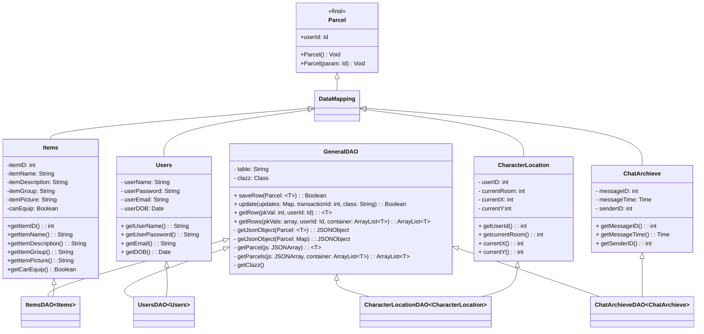
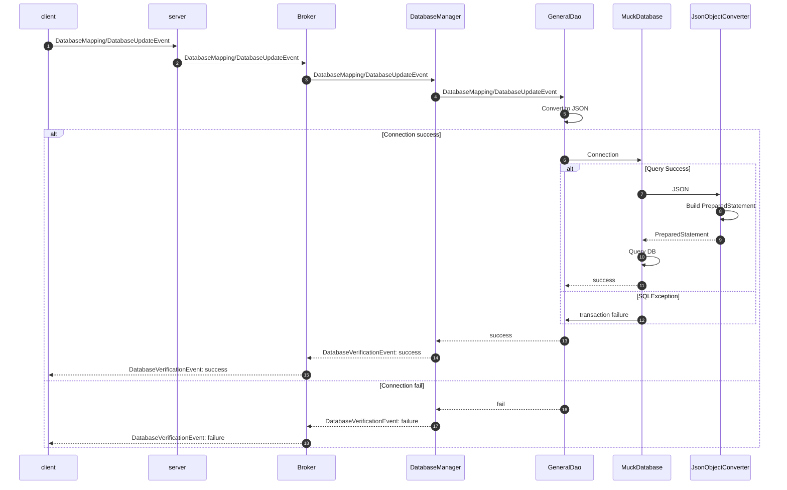
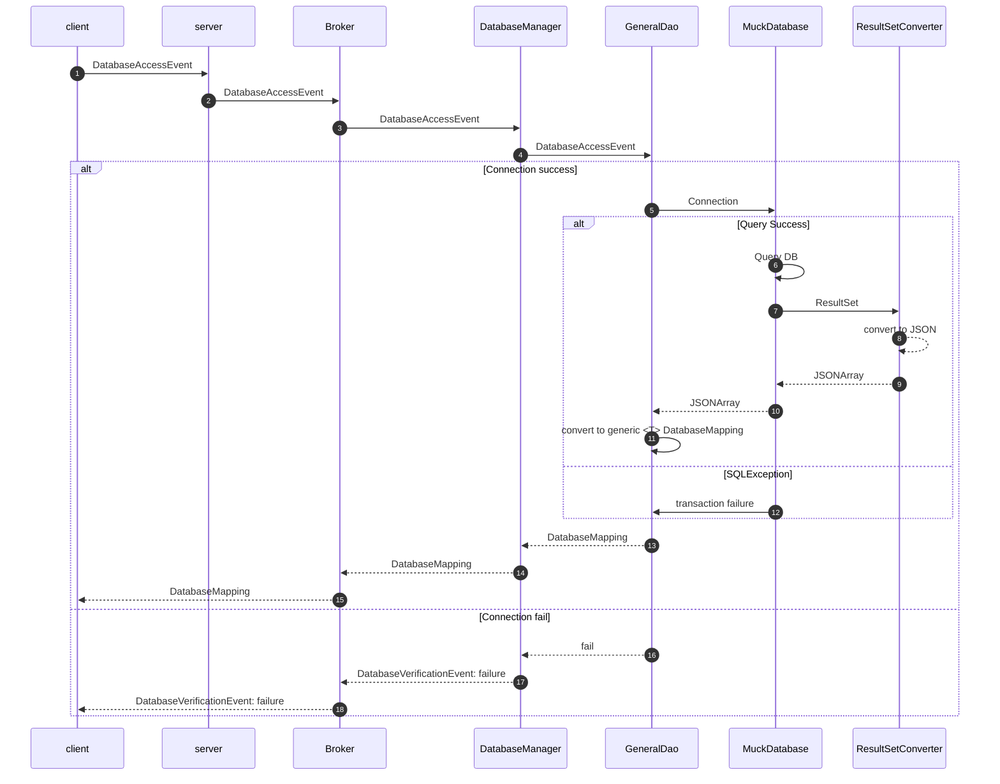

## Mermaid UML's

```mermaid
classDiagram
  Parcel <|-- DataMapping
  DataMapping <|-- Items
  DataMapping <|-- Users
  DataMapping <|-- CharacterLocation
  DataMapping <|-- ChatArchieve
  GeneralDAO <|-- UsersDAO~Users~
  GeneralDAO <|-- ItemsDAO~Items~
  GeneralDAO <|-- CharacterLocationDAO~CharacterLocation~
  GeneralDAO <|-- ChatArchieveDAO~ChatArchieve~
  Items <|-- ItemsDAO~Items~
  Users <|-- UsersDAO~Users~
  CharacterLocation <|-- CharacterLocationDAO~CharacterLocation~
  ChatArchieve <|-- ChatArchieveDAO~ChatArchieve~


  class Parcel{
    <<final>>
    +userId: Id<User>
    +Parcel() Void
    +Parcel(param: Id<User>) Void
  }

  class DataMapping {

    }

    class Items{
        -itemID: int
        -itemName: String
        -itemDescription: String
        -itemGroup: String
        -itemPicture: String
        -canEquip: Boolean
        +getItemID(): int
        +getItemName(): String
        +getItemDescription(): String
        +getItemGroup(): String
        +getItemPicture():String
        +getCanEquip():Boolean
    }

    class Users{
        - userName: String
        - userPassword: String
        - userEmail: String
        - userDOB: Date
        + getUserName(): String
        + getUserPassword(): String
        + getEmail(): String
        + getDOB(): Date
    }

    class CharacterLocation{
        - userID: int
        - currentRoom: int
        - currentX: int
        - currentY:int
        + getUserId(): int
        + getcurrentRoom(): int
        + currentX(): int
        + currentY(): int
    }

    class ChatArchieve{
        - messageID: int
        - messageTime: Time
        - senderID: int
        + getMessageID(): int
        + getMessageTime(): Time
        + getSenderID(): int
    }

    class GeneralDAO~T~{
    - table: String
    - clazz: Class
    + saveRow(Parcel: ~T~): Boolean
    + update(updates: Map<String, Object>, transactionId: int, class: String ): Boolean
    + getRow(pkVal: int, userId: Id): ~T~
    + getRows(pkVals: array, userId: Id, container: ArrayList~T~): ArrayList~T~
    - getJsonObject(Parcel: ~T~): JSONObject
    - getJsonObject(Parcel: Map<String, Object>): JSONObject
    - getParcel(js: JSONArray): ~T~
    - getParcels(js: JSONArray, container: ArrayList~T~): ArrayList~T~
    - getClazz()
}

class UsersDAO~Users~{
    
}
class ChatArchieveDAO~ChatArchieve~{
    
}
class CharacterLocationDAO~CharacterLocation~{
    
}
class ItemsDAO~Items~{
    
}

```

```mermaid
sequenceDiagram
    autonumber
    participant client
    participant server
    participant Broker
    participant DatabaseManager
    participant GeneralDao
    participant MuckDatabase
    participant JsonObjectConverter

    client->>server: DatabaseMapping/DatabaseUpdateEvent
    server->>Broker: DatabaseMapping/DatabaseUpdateEvent
    Broker->>DatabaseManager: DatabaseMapping/DatabaseUpdateEvent
    DatabaseManager->>GeneralDao: DatabaseMapping/DatabaseUpdateEvent
    GeneralDao->>GeneralDao: Convert to JSON
    

    alt Connection success
    GeneralDao->>MuckDatabase: Connection
        alt Query Success
            MuckDatabase->>JsonObjectConverter: JSON
            JsonObjectConverter->>JsonObjectConverter: Build PreparedStatement
            JsonObjectConverter-->>MuckDatabase: PreparedStatement
            MuckDatabase->>MuckDatabase: Query DB
            MuckDatabase-->>GeneralDao: success
    
        else SQLException
            MuckDatabase->>GeneralDao: transaction failure
        end
    
    
    
    
    GeneralDao-->>DatabaseManager: success
    DatabaseManager-->>Broker: DatabaseVerificationEvent: success
    Broker-->>client: DatabaseVerificationEvent: success
    else Connection fail
    
    GeneralDao-->>DatabaseManager:fail
    DatabaseManager-->>Broker: DatabaseVerificationEvent: failure
    Broker-->>client: DatabaseVerificationEvent: failure

    end
```

```mermaid
sequenceDiagram
    autonumber
    participant client
    participant server
    participant Broker
    participant DatabaseManager
    participant GeneralDao
    participant MuckDatabase
    participant ResultSetConverter

    client->>server: DatabaseAccessEvent
    server->>Broker: DatabaseAccessEvent
    Broker->>DatabaseManager: DatabaseAccessEvent
    DatabaseManager->>GeneralDao: DatabaseAccessEvent


    alt Connection success
    GeneralDao->>MuckDatabase: Connection
        alt Query Success
            MuckDatabase->>MuckDatabase: Query DB
            MuckDatabase->>ResultSetConverter: ResultSet
            ResultSetConverter-->>ResultSetConverter: convert to JSON
            ResultSetConverter-->>MuckDatabase: JSONArray
            MuckDatabase-->>GeneralDao: JSONArray
            GeneralDao->>GeneralDao: convert to generic <T> DatabaseMapping
    
        else SQLException
            MuckDatabase->>GeneralDao: transaction failure
        end
    
    
    GeneralDao-->>DatabaseManager: DatabaseMapping
    DatabaseManager-->>Broker: DatabaseMapping
    Broker-->>client: DatabaseMapping
    else Connection fail
    
    GeneralDao-->>DatabaseManager:fail
    DatabaseManager-->>Broker: DatabaseVerificationEvent: failure
    Broker-->>client: DatabaseVerificationEvent: failure

    end
        

```